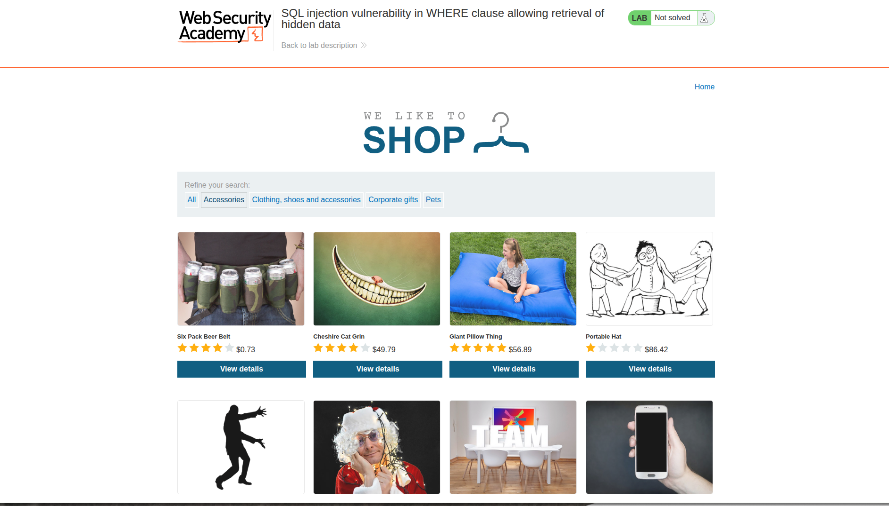
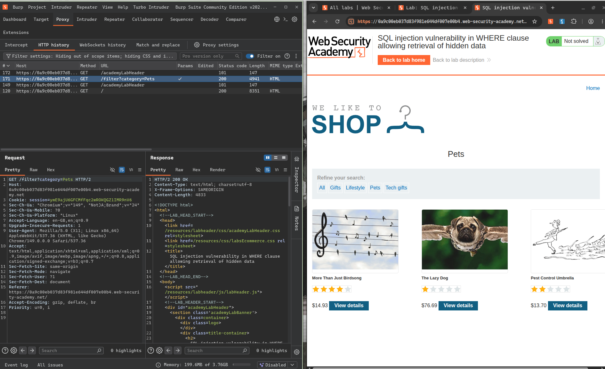
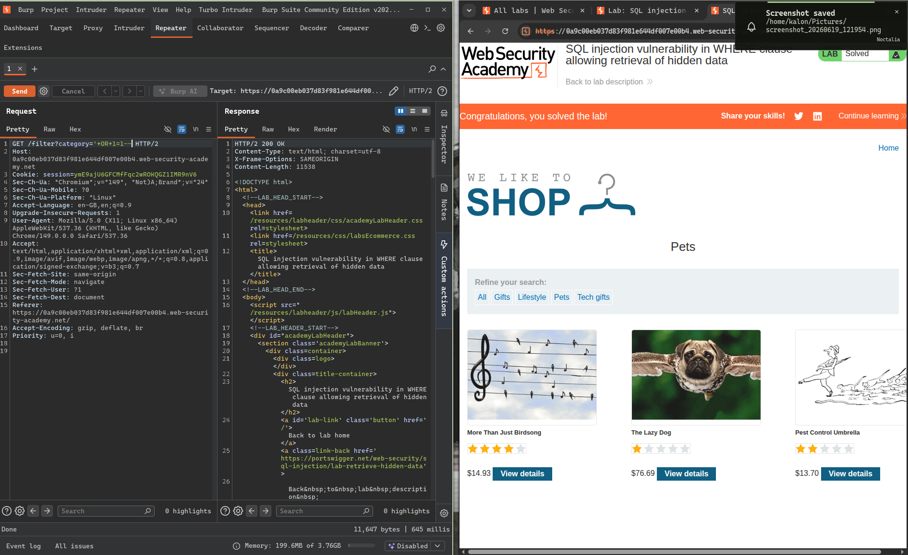
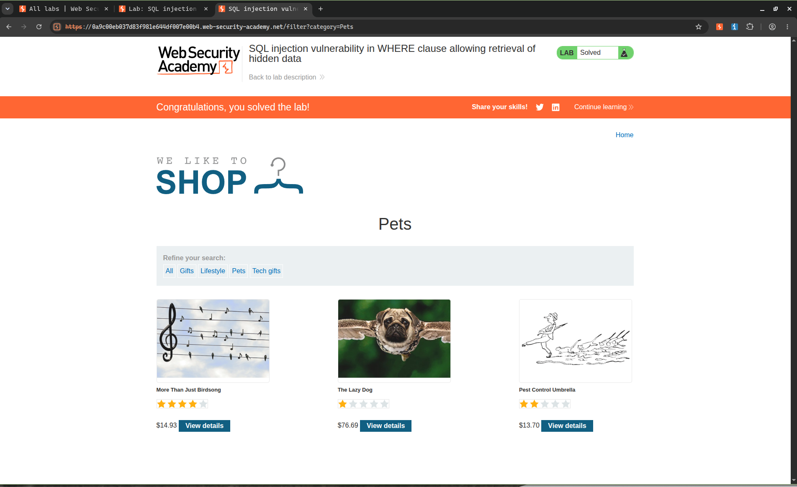

# Title: SQL Injection in WHERE Clause Allowing Retrieval of Hidden Data

# **Description**

The product category filter on this application is vulnerable to SQL injection. The input goes straight into the backend query with no sanitization — so you can break out of the string and rewrite the logic entirely.

The query being run looks like this:

```sql
SELECT * FROM products WHERE category = 'Gifts' AND released = 1
```

The `released = 1` check is what keeps unreleased products hidden. Once you break the query logic, that check gets thrown out and everything in the table comes back.

# **Steps to Exploit**

1. Go to the product listing page and click on any category.
2. Turn on Intercept in Burp Suite before clicking.
3. Catch the GET request — the `category` parameter is right there in the URL.
4. Change the category value to:
   ```
   '+OR+1=1--
   ```
5. Forward the request.
6. The page now shows all products, including the ones that were supposed to be hidden.

# **Proof of Concept**

**Payload:**
```
' OR 1=1--
```

**Original Query:**
```sql
SELECT * FROM products WHERE category = 'Gifts' AND released = 1
```

**Modified Query:**
```sql
SELECT * FROM products WHERE category = '' OR 1=1--' AND released = 1
```

The `'` closes the category string. `OR 1=1` makes the condition always true so every row matches. The `--` comments out the rest of the query, so the `released = 1` filter never runs. All products get returned.

**Screenshot 1 – Normal product listing (before injection):**


**Screenshot 2 – Burp Suite intercepted request:**


**Screenshot 3 – Modified request with payload:**


**Screenshot 4 – Unreleased products now visible (lab solved):**


# **Impact**

- Hidden/unreleased product data is exposed to anyone who sends the request.
- The `released = 1` access control is completely bypassed — it exists only at the SQL level and offers no real protection here.
- This kind of injection can be extended further — UNION attacks, data extraction, auth bypass — once the entry point is confirmed.
- Any business-sensitive info stored in the table is at risk.

# **Mitigation / Remediation**

1. Switch to **parameterized queries** — the user input should never touch the SQL string directly.
2. Validate and sanitize input server-side — special characters like `'` and `--` shouldn't be passing through unchecked.
3. Use least privilege for the DB account — the app probably doesn't need to read every table.
4. An ORM would handle this safely by default and is worth considering.

---

# **CVSS Justification**

| Metric | Value | Justification |
|---|---|---|
| Attack Vector | Network | Just needs a web request, no physical access |
| Attack Complexity | Low | Straight payload, no special setup needed |
| Privileges Required | None | No login required |
| User Interaction | None | Attacker does this on their own |
| Scope | Unchanged | Stays within the app and its DB |
| Confidentiality Impact | Low | Exposes hidden product data, not credentials |
| Integrity Impact | None | Read-only, nothing gets modified |
| Availability Impact | None | App keeps running fine |

**CVSS Score: 5.3 (Medium)**
`CVSS:3.1/AV:N/AC:L/PR:N/UI:N/S:U/C:L/I:N/A:N`
