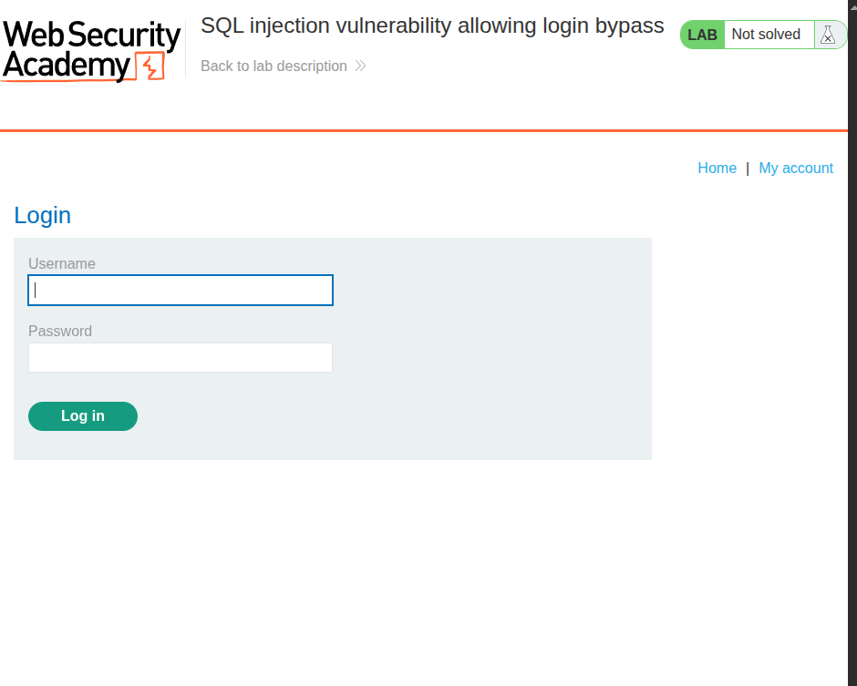
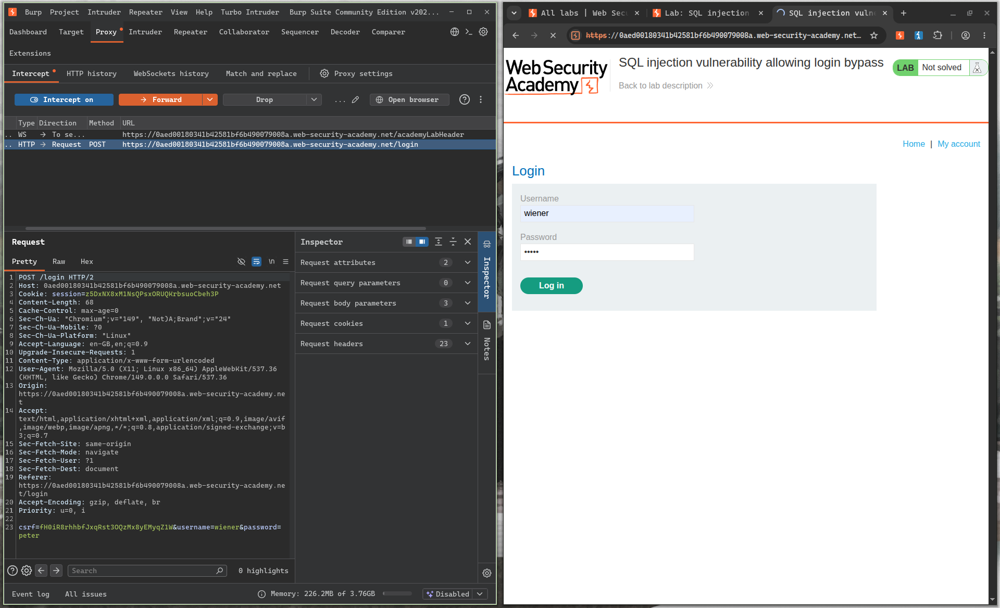
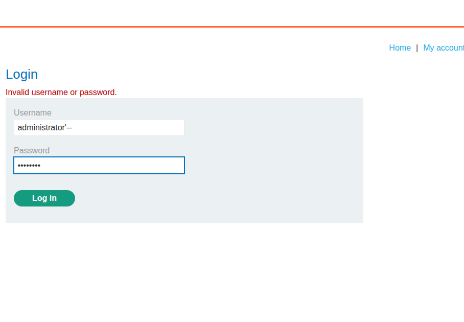
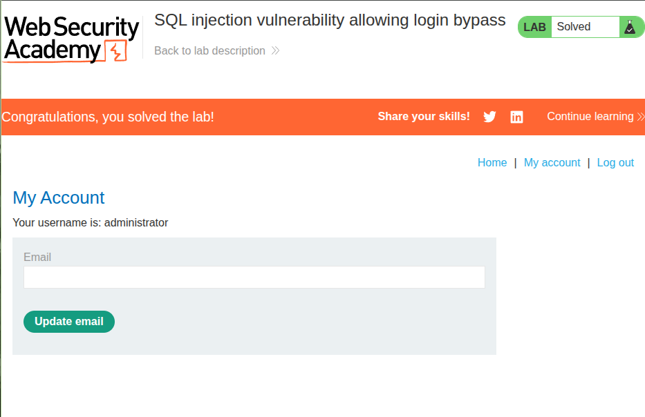

# Title: SQL Injection in Login Function Allowing Authentication Bypass

# **Description**

The login form is vulnerable to SQL injection in the `username` field. There's no input sanitization, so you can inject into the query and completely skip the password check.

The backend is probably running something like this when you log in:

```sql
SELECT * FROM users WHERE username = 'administrator' AND password = 'somepassword'
```

The fix for this is trivially simple — parameterized queries — but since the app doesn't use them, you can just comment out the password condition and log in as anyone.

# **Steps to Exploit**

1. Go to the login page.
2. Turn on Intercept in Burp Suite.
3. Enter anything in the password field — it won't matter.
4. Submit the form and catch the POST request in Burp.
5. Find the `username` parameter and change it to:
   ```
   administrator'--
   ```
6. Forward the request.
7. You're now logged in as `administrator` with no password.

# **Proof of Concept**

**Payload:**
```
administrator'--
```

**Original Query:**
```sql
SELECT * FROM users WHERE username = 'administrator' AND password = 'somepassword'
```

**Modified Query:**
```sql
SELECT * FROM users WHERE username = 'administrator'--' AND password = 'somepassword'
```

`administrator` matches the account. The `'` closes the username string. `--` comments out everything after it, so the `AND password = '...'` check never runs. The DB finds the admin row, returns it, and the app thinks the login was valid.

**Screenshot 1 – Login page (before injection):**


**Screenshot 2 – Burp Suite intercepting the login POST request:**


**Screenshot 3 – Username field modified with payload:**


**Screenshot 4 – Logged in as administrator (lab solved):**


# **Impact**

- You can log in as any user — including admin — without knowing their password.
- Full administrative access means you can do pretty much anything in the app.
- This could be used to dump data, modify records, delete users, or just poke around where you shouldn't be.
- One of the more dangerous SQLi variants because it hits authentication directly.

# **Mitigation / Remediation**

1. **Parameterized queries** — non-negotiable for anything touching a login form.
2. Input validation on the username field — `'` and `--` should never be passing through.
3. Add MFA — even if someone bypasses the password check, a second factor would stop them.
4. Log failed and unusual login attempts — a bunch of `'--` in usernames should be alerting someone.
5. Least privilege on the DB account — the login query shouldn't be running as a user with write access to everything.

---

# **CVSS Justification**

| Metric | Value | Justification |
|---|---|---|
| Attack Vector | Network | Done over the web, no local access needed |
| Attack Complexity | Low | Simple payload, works first try |
| Privileges Required | None | You don't need an account to start |
| User Interaction | None | No one else needs to do anything |
| Scope | Unchanged | Contained to the app and DB |
| Confidentiality Impact | High | Full admin access means everything is readable |
| Integrity Impact | High | Admin can modify or delete any data |
| Availability Impact | High | Admin access could be used to bring the app down |

**CVSS Score: 9.8 (Critical)**
`CVSS:3.1/AV:N/AC:L/PR:N/UI:N/S:U/C:H/I:H/A:H`

