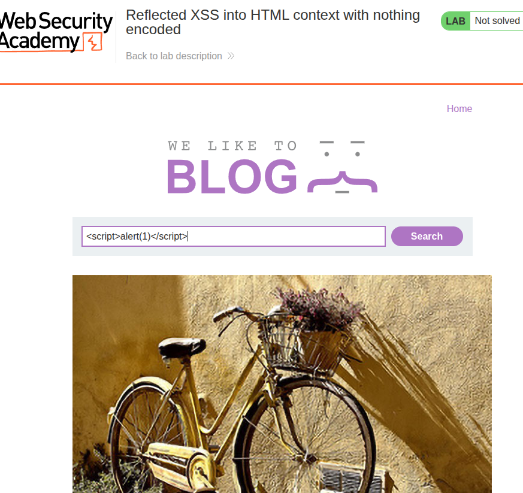
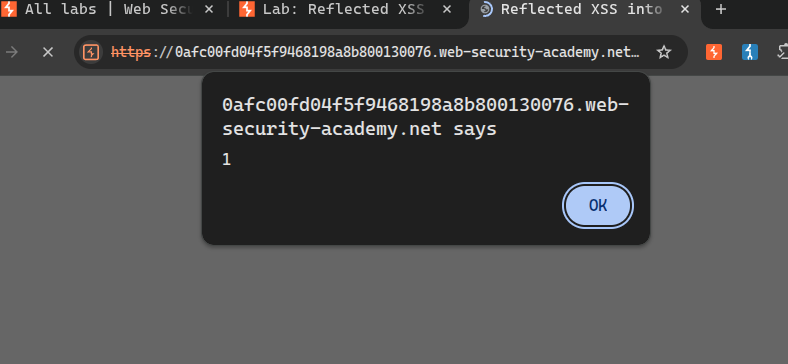

# Title: Reflected XSS into HTML Context with Nothing Encoded

# Description

The search functionality on this application takes a user-supplied search term and reflects it directly back into the HTML response without any encoding or sanitization. When you search for something, the search term appears on the results page inside the HTML — and since there's no filtering, any HTML or JavaScript you inject gets rendered and executed by the browser.

This is a classic reflected XSS vulnerability. The malicious script isn't stored anywhere — it lives in the URL. The attack works when the victim clicks a crafted link containing the payload in the search parameter, causing their browser to execute the injected JavaScript in the context of the vulnerable site.

# Steps to Exploit

1. Navigate to the application's home page.
2. Locate the search box at the top of the page.
3. Type the following payload into the search box and click "Search":
   ```html
   <script>alert(1)</script>
   ```
4. Observe that instead of searching for the literal text, the browser executes the JavaScript and an alert box pops up displaying `1`.
5. This confirms that the search term is being reflected into the HTML response without any encoding, and the browser is treating the injected script as executable code.

# Proof of Concept

**Payload:**
```html
<script>alert(1)</script>
```

**Vulnerable URL (after submitting):**
```
/?search=<script>alert(1)</script>
```

**What the server returns in the HTML:**
```html
<h1>0 search results for '<script>alert(1)</script>'</h1>
```

The search term is placed directly between HTML tags with no sanitization. The browser parses the response and sees a `<script>` tag, so it executes the JavaScript inside it — triggering the alert. In a real attack, `alert(1)` would be replaced with a payload that steals session cookies or performs actions on behalf of the victim.





# Impact

• An attacker can craft a malicious URL containing the XSS payload and trick a victim into clicking it (e.g., via phishing).
• The injected JavaScript runs in the victim's browser under the context of the trusted site, bypassing same-origin policy.
• Session cookies can be stolen and used to hijack the victim's account.
• The attacker can perform any action on the site that the victim is authorized to do — posting content, changing account details, making purchases.
• Can be used to redirect victims to phishing pages or install browser-based malware.

# Mitigation / Remediation

1. HTML-encode all user-supplied input before reflecting it in the response — `<` becomes `&lt;`, `>` becomes `&gt;`, etc.
2. Implement a strict Content Security Policy (CSP) to restrict which scripts the browser is allowed to execute.
3. Use context-aware output encoding — different encoding rules apply depending on whether the data is being placed in HTML, JavaScript, a URL, or a CSS context.
4. Validate input server-side and reject values that contain characters with no legitimate use in a search term (like `<`, `>`, `"`).

# CVSS Score

CVSS v3.1 Score: 6.1 (Medium)
Vector: CVSS:3.1/AV:N/AC:L/PR:N/UI:R/S:C/C:L/I:L/A:N

**CVSS Justification**

Attack Vector: Network (Payload is delivered via a crafted URL sent over the internet)
Attack Complexity: Low (No special conditions required — a simple script tag works)
Privileges Required: None (The search box is publicly accessible without login)
User Interaction: Required (A victim must click the malicious link for the attack to succeed)
Scope: Changed (The injected script runs in the victim's browser, escaping the server's context)
Confidentiality Impact: Low (Can steal session cookies or sensitive data visible on the page)
Integrity Impact: Low (Can modify page content or perform actions on behalf of the victim)
Availability Impact: None (No disruption to the service itself)
