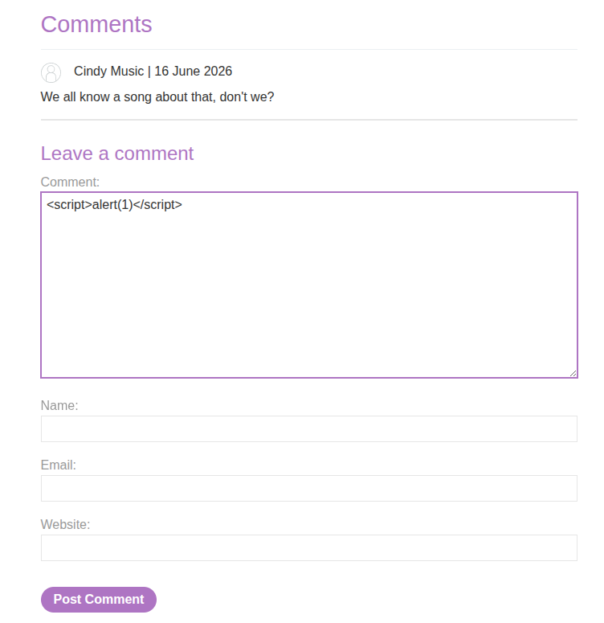
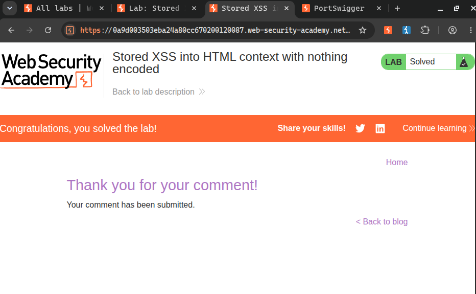

# Title: Stored XSS into HTML Context with Nothing Encoded

# Description

The blog post comment functionality stores user-submitted comments in a database and renders them back on the page for every visitor. The comment text is reflected into the HTML response without any encoding or sanitization, meaning any HTML or JavaScript injected into a comment gets stored on the server and executed in every visitor's browser when they view that blog post.

Unlike reflected XSS where the payload lives in a URL and only affects users who click that specific link, stored XSS is persistent — the malicious script fires automatically every time anyone loads the affected page. This makes it significantly more dangerous since no social engineering is required after the initial injection.

# Steps to Exploit

1. Navigate to any blog post on the application.
2. Scroll down to the comment section.
3. In the **Comment** field, enter the following payload:
   ```html
   <script>alert(1)</script>
   ```
4. Fill in a name, email address, and website (any values work).
5. Click "Post comment".
6. You are redirected back to the blog post.
7. As soon as the page loads, the browser executes the stored script and an alert box pops up displaying `1`.
8. The payload is now stored in the database — every user who visits this blog post will trigger the alert.

# Proof of Concept

**Payload (entered into the Comment field):**
```html
<script>alert(1)</script>
```

**What gets stored and later rendered in the HTML:**
```html
<p><script>alert(1)</script></p>
```

The comment is saved to the database as-is. When any user loads the blog post, the server fetches stored comments and injects them into the page HTML without encoding. The browser sees the `<script>` tag in the response body, treats it as code, and executes it immediately — triggering the alert for every visitor.





# Impact

• The payload fires automatically for every user who views the blog post — no interaction or link-clicking required from the victim.
• Session cookies can be stolen from any visitor, allowing account takeover at scale.
• Attackers can perform actions on behalf of every visitor — changing account details, making purchases, posting further malicious content.
• Particularly dangerous on high-traffic pages — a single injected comment can compromise hundreds of user sessions.
• Can be used to redirect all visitors to phishing sites or deliver browser exploits silently.

# Mitigation / Remediation

1. HTML-encode all user-supplied content before rendering it in the page — the comment text should be stored raw but encoded on output.
2. Implement a Content Security Policy (CSP) to prevent execution of inline scripts, limiting the damage even if injection occurs.
3. Sanitize input server-side using an allowlist approach — strip or reject any HTML tags from comment fields entirely.
4. Apply output encoding consistently at every point where user data is rendered, not just at the input stage.

# CVSS Score

CVSS v3.1 Score: 8.2 (High)
Vector: CVSS:3.1/AV:N/AC:L/PR:L/UI:R/S:C/C:H/I:L/A:N

**CVSS Justification**

Attack Vector: Network (Payload is submitted and stored via an HTTP POST request)
Attack Complexity: Low (Standard script tag, no special conditions needed)
Privileges Required: Low (Posting a comment may require being logged in or just filling a form — minimal barrier)
User Interaction: Required (A victim must visit the blog post page to trigger the stored payload)
Scope: Changed (The injected script runs in victims' browsers, outside the server's direct control)
Confidentiality Impact: High (Session cookies and sensitive page data can be stolen from any visitor)
Integrity Impact: Low (Can manipulate page content and perform limited actions on behalf of victims)
Availability Impact: None (No disruption to the service itself)
